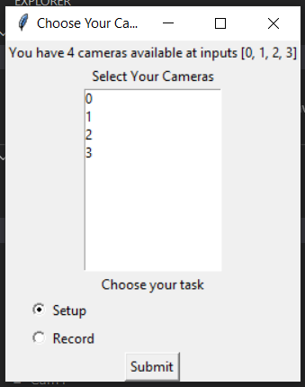
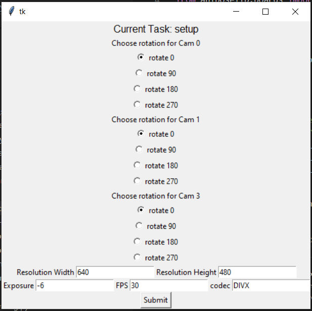

# Troubleshooting Guides

The following troubleshooting guides follow this outline:
    
    # General Error Category

    ## More Specific Description of Error

**1. Problem**
    
    - Provide a clear, concise description of the problem the user is trying to solve. Who, what, when, where?  

**2. Solution(s)**

    - Provide an ordered list of steps to guide someone through the solution. Copy and paste useful parts of the error codes. (No screen shots. Ideally, we want to be able to search the error codes themselves).

**3. Cause(s)**

    - A highlevel paragraph of why the error happened. 

**4. Related info**
    
    - A more indepth reason why the error occured. Jon, this one's for you :)

---

# Calibration Errors

## Cameras crashing during calibration, pre-alpha version 0.0.54

**1. Problem:** 

During camera setup, when you select all your camera settings and then click the 'Submit' button, you see your camera viewing panes pop up. However, one or more of them crash and just disappear. 

**2. Solution**

- First, make sure your computers is not in battery saving mode. 
- Then, go back to camera settings in the gui and make sure the media pipe overlay option is toggled off. Then click the 'Submit' button and view the video viewing panes again. 

**3. Cause(s):**

Your CPU may be overloaded. 

**4. Related info**

What other infomration may be needed here? 

## Recovering from a crash during calibration
**1. Problem**

**2. Solution**

**3. Causes**

**4. Related info**

---
## Builtin laptop camera is being picked up by freemocap 

**1. Problem:**

During calibration, you'll see the number of cameras 

**2. Solution:**

This is totally normal and will happen on every laptop with a built in camera. The solution is simply to note which camera number this camera is and to deselect it before going forward with the calibration. You'll have to do this no matter what version of freemocap you're using. 

The following specific solution is for the pre-alpha version 0.0.54:

When you run the freemocap.RunMe(charucoSquareSize=?) command in your terminal or IDE. 

This camera selection window will pop up:

If you have plugged three cameras into three different usb ports on your machine, but your machine also has a built in laptop camera, you'll have four cameras available as shown above. You likely won't know which camera is which yet so, select all of them, make sure setup is selected rather than record, and click 'Submit'.
That will bring you to this: 

No need to change any of these settins at first, just click 'Submit' and you'll see all the viewing panes of all your cameras pop up. One of them will be the computers webcam camera. Take note of which camera it is (camera 0, camera 1, etc). 

Press esc till all the camera windows disappear and then you'll see a little box pop up with a session name and the options to "Change Folder Path", "Change Parameters", "Proceed to Recording" or "Quit". 

**If one of the cameras that's up is your computers physical webcam, you'll press "Quit"**. 

Now you'll have to rerun the runme.freemocap.py file. Once you do that, the camera selection window will pop back up. This time, make sure to **not** select the camera that represents the computers built in webcam.  Select submit on the camera selection window, then again on the settings selection window, and you should see the video panes pop up, this time without the laptops built in webcam. 

If there are any other settings you want to change based on what you're seeing in your camera viewing panes. Press quit to exit out of the viewing panes, and then when the new window pops up with options to "Change Folder Path", "Change Parameters", "Proceed to Recording" or "Quit". Select "Change Parameters" to go back to the settings selection window. 

**3. Cause(s):**
**4. Related info:**

---
## Timestamp Diagnostics: Cameras Don't Have the Same Frame Rate 