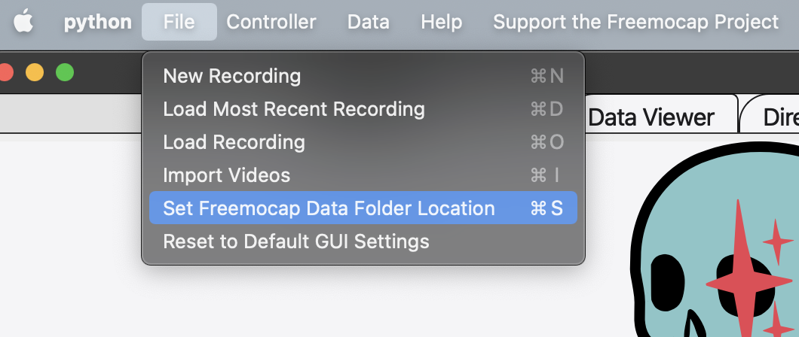

# Navigating the FreeMoCap Data Folder

FreeMoCap stores all of your session data in a folder called `freemocap_data`.
This contains all the data created by FreeMoCap, including recording sessions, log files, and calibration files.

The typical `freemocap_data` folder structure is:
```
freemocap_data
├── calibrations
├── logs_info_and_settings
└── recording_sessions
```

The contents of each subfolder will be described below. 

> Changing location of FreeMoCap Data Folder
> 
> By default, the `freemocap_data` folder is stored in your home directory, but you can change the location from within FreeMoCap.
> In the `Menu Bar`, choose `File -> Set Freemocap Data Folder Location`.
> This will bring up a file dialog allowing you to select a new location for the folder.
> To save your change, click `Save and Reboot` to save your choice, after which the gui will reboot.
> Your new `freemocap_data` folder will now be active.
>
> 
>
> Changing the location of the `freemocap_data` folder in this way only sets a new location to use as the data folder, but does not copy any of the data from your previous `freemocap_data` folder. Any data you would like in the new location must be manually copied over.


## Calibrations

The `calibrations` folder contains every calibration `.toml` file you've created.
Each file is named after the recording folder it was created from, allowing you to match recordings to their calibration.
A copy of the calibration `toml` is saved to each recording processed with it, so you don't need to access the  calibrations` folder very often.

The `calibrations` folder is created when you process your first calibration, so it will not exist the first time you open FreeMoCap.

An example `calibrations` folder will look like:
```
freemocap_data/calibrations
├── freemocap_sample_data_camera_calibration.toml
├── freemocap_test_data_camera_calibration.toml
├── recording_14_03_58_gmt-7_calibration_camera_calibration.toml
└── recording_16_55_49_gmt-7_calibration_camera_calibration.toml
```

## Logs, Info, and Settings

The `logs_info_and_settings` folder contains log files from each time you open FreeMoCap. 
The log files contain the output printed to your terminal while running the GUI, and can be very useful in diagnosing problems that occur while running the software.
The log files are contains in `logs_info_and_settings/logs`, and can be opened as normal text files.
The `logs_info_and_settings` folder also contains `last successful_calibration.toml`, which is the last calibration you've successfully processed, and `most_recent_recording.toml`, which is the calibration used for the last recording you've processed. 

An example `logs_info_and_settings` folder will look like:
```
freemocap_data/logs_info_and_settings
├── last_successful_calibration.toml
├── logs
│   ├── log_11-06-2024-16_57_33.log
│   ├── log_11-06-2024-16_58_25.log
│   └── log_11-06-2024-17_08_02.log
└── most_recent_recording.toml
```

## Session Folders and Recording Folders

The `recording_sessions` folder contains all the video and motion capture data recorded with FreeMoCap.
The data is separated into different sessions, which may contain a single recording or a group of recordings.

For videos recorded through the FreeMoCap GUI, each recording is grouped under a session that includes all recordings made during that GUI session.
In the example below, `session_2024-06-27_15_07_36` contains two recordings: `recording_11_27_04_gmt-4` and `recording_11_27_32_gmt-4`.

For videos imported into FreeMoCap, each recording goes directly into the `recording_sessions` folder. 
For example, the `freemocap_sample_data` recording was imported, so it does not go inside a session folder.

An example `recording_sessions` folder will look like: 
```
freemocap_data/recording_sessions
├── freemocap_sample_data
│   ├── annotated_videos
│   ├── output_data
│   │   ├── center_of_mass
│   │   └── raw_data
│   ├── saved_data
│   │   ├── csv
│   │   ├── info
│   │   └── npy
│   └── synchronized_videos
└── session_2024-06-27_15_07_36
    ├── recording_11_27_04_gmt-4
    │   ├── annotated_videos
    │   ├── output_data
    │   │   ├── center_of_mass
    │   │   └── raw_data
    │   ├── saved_data
    │   │   ├── csv
    │   │   ├── info
    │   │   └── npy
    │   └── synchronized_videos
    │       └── timestamps
    └── recording_11_27_32_gmt-4
        ├── annotated_videos
        ├── output_data
        │   ├── center_of_mass
        │   └── raw_data
        ├── saved_data
        │   ├── csv
        │   ├── info
        │   └── npy
        └── synchronized_videos
            └── timestamps
```

To see more information about the contents of a recording folder, see the [Data Format Guide](data_format.md).
