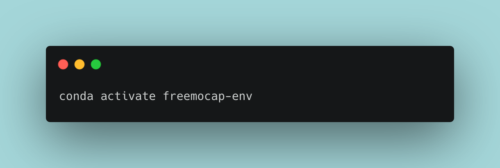
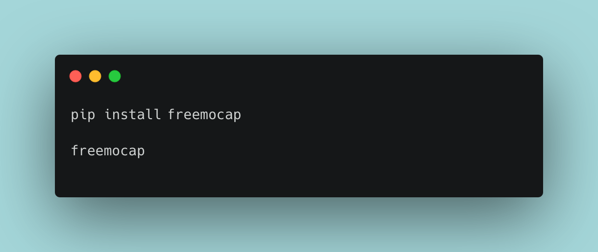

___
# Welcome! :skull: :wave:
Thanks for your interest in using the FreeMoCap software! We're excited to have you here, and we're looking forward to seeing what you create with our tool!

FreeMoCap runs on Windows, Mac (ARM and Intel), and Linux operating systems.

Follow the instructions below, starting with the environment setup and package installation steps and you'll be up and running in no time! 

Head on over to our [Discord](https://discord.gg/j76UGWfEeA) and let us know if you run into any issues getting FreeMoCap running on your machine. We're always working to improve cross-platform compatibility and appreciate your feedback. Now let's get started capturing some motion!


!!! tip-full-width "QUICKSTART"
    In a Python 3.9 through 3.11 environment, enter: 
    ```
    pip install --pre freemocap   
    freemocap
    ```
___
___
# Installation Instructions:

## 1. Open a terminal window
!!! tip ""

    === "Windows"
    
        Press the `Windows key`, type "Anaconda Prompt", and press Enter.
    
    === "Mac"
    
        Press `command + spacebar` and type "terminal" and press Enter. 
    
    === "Linux"
    
        Press `ctrl + alt + t` to open a terminal window.
    
## 2. Create a new Python environment 
- Install [Anaconda](https://www.anaconda.com/download) (or [Miniconda](https://docs.conda.io/en/latest/miniconda.html)) if you haven't already.

- Create a new Python environment (verions 3.9 through 3.11 recommended). To do so, enter the following command in your terminal: 
```bash
conda create -n freemocap-env python=3.11 -y
```


??? info "Python Environments" 
    This step creates a new installation of Python on your system that will be used to run the code behind the FreeMoCap software!

    For more information about Python environments, [check out this guide from Real Python](https://realpython.com/python-virtual-environments-a-primer/)
    

- Activate that newly created environment
```bash
conda activate freemocap-env
```


## 3. Install software

=== "PyPi (pip)"

    ```bash
    pip install --pre freemocap
    ```

=== "Github (source code)" 

    ```
    git clone https://github.com/freemocap/freemocap
    cd freemocap
    pip install -e .    
    ```

## 4. Launch the GUI
To launch FreeMoCap, enter the command `freemocap` into the terminal, like this:
```
freemocap
```
Put together, steps 3 & 4 should look like this in your terminal:



Once `freemocap` is entered into your terminal, a GUI should pop up that looks something like this:


# Congrats, you're in! :sunglasses:

Now that you've got FreeMoCap installed, follow the instructions in the [Single-Camera Tutorial](getting_started/single_camera_recording/) (and/or [Multi-Camera Calibration Guide](getting_started/multi_camera_calibration/) guide) section for next steps!

