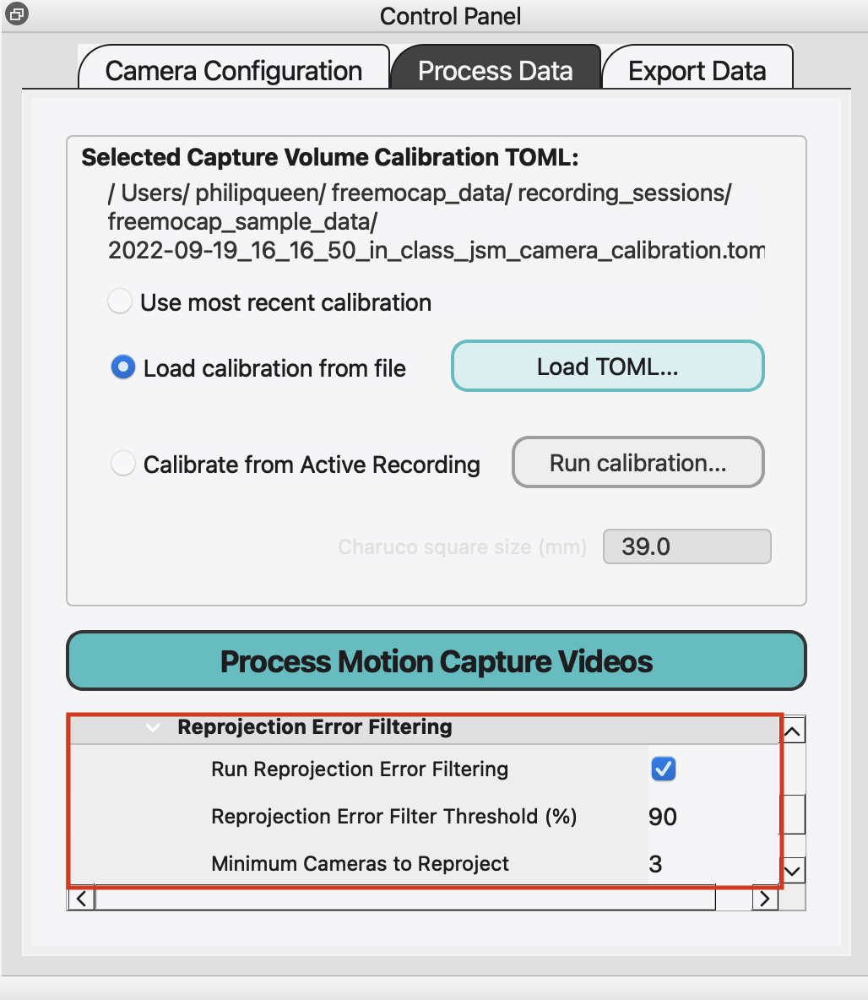

# Reprojection Error Filtering

Reprojection error filtering is an optional postprocessing step to the 3D triangulation stage of processing. It retriangulates outlier data from the 3d triangulation with the cameras contributing the most error removed. Reprojection error filtering is most effective when there is poor skeleton detection in one or more camera views. It is turned on and off in "Process Data" tab with the checkbox "Run Reprojection Error Filtering". It is turned off by default.

## What is Reprojection Error?
"Reprojection error" is the distance between the originally measured point (i.e. a joint on the 2d skeleton) and the reconstructed 3d point reprojected back onto the original image. The intuition is that if the 3d reconstruction and original 2d track are perfect, then reprojection error will be zero. If it isn't, then there is some inaccuracy in either: the original 2d tracks (i.e. bad skeleton detection from one or more cameras), in the 3d reconstruction (i.e. bad camera calibration), or a combination of the two.

## How Does Reprojection Error Filtering Work?
Reprojection error filtering can help when there is poor skeleton detection in one or more camera views. It starts by finding the outliers in the reprojection error, defined as all points above a certain threshold error value calculated as a percentile of the data. It then retriangulates the data with the camera contributing the most error (for that specific frame and marker) removed. If there are still reprojection errors above the threshold, it repeats the process but also removes the camera that contributes the second most to the error. It continues this process until all reprojection errors are below the threshold, or until it hits the minimum number of cameras left. If it hits the minimum camera limit, it sets the remaining data that still has a reprojection error above the threshold to NaNs, which will then be gap filled in the post processing stage. Once this process is complete, it reinserts the filtered data back into the normal data.

## What are the Parameters and What Do They Do?
The first parameter is "Run Reprojection Error Filtering", a checkbox that sets whether to run the reprojection error filtering process. It is turned off by default.

The second parameter is "Reprojection Error Threshold (%)", which sets the percentile above which reprojection errors will be filtered out. The percentile threshold will be calculated to an absolute error, and then that absolute error will be the comparison for the data. Setting a lower threshold will result in more data being retriangulated, while setting a higher threshold will result in less data being retriangulated. It is set to 90% by default.

The third parameter is "Minimum Number of Cameras Left", which sets the minimum number of cameras to remain in the triangulation process during the reprojection error filtering. If the filtering process is able to remove all outliers before the minimum number of cameras is reached, the reprojection error filtering process will stop. If outliers remain after the minimum number of cameras is reached, the remaining outlier data will be set to NaNs. The minimum possible value is 2, as two camera views are required for 3D triangulation. If the minimum number of cameras is greater than or equal to the total number of cameras in the recording, the reprojection error filtering process will not run. It is set to 3 by default.

## Note about Debug Plots
A debug plot for the reprojection error filtering is saved to the `output_data/raw_data` folder of your recording session. The reprojection error filtering runs on a per camera and per marker level, while the debug plot displays the mean reprojection error for a frame across all body markers and cameras. This can lead to plots that don't show the filtering results very well.