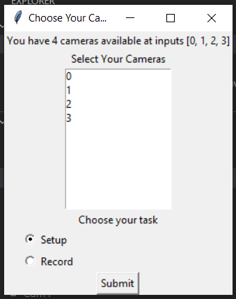
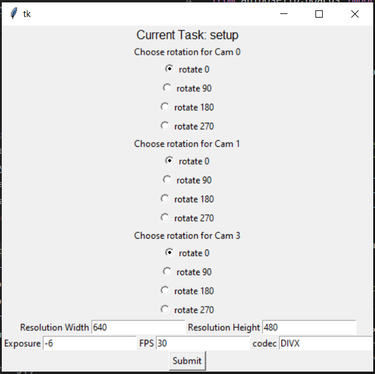

# Cameras and Software Setup

## Cameras Crashing During Calibration, pre-alpha version 0.0.54

**1. Problem:** 

During camera setup, when you select all your camera settings and then click the 'Submit' button, you see your camera viewing panes pop up. However, one or more of them crash and just disappear. 

**2. Solution**

- First, make sure your computers is not in battery saving mode. 
- Then, go back to camera settings in the GUI and make sure the media pipe overlay option is toggled off. Then click the 'Submit' button and view the video viewing panes again. 
- Close other running programs.

**3. Cause(s):**

Your CPU may be overloaded. 

**4. Related info**

Media pipe overlay is a lot to ask of your computer's CPU. 

---
## Unwanted Builtin Laptop Camera

**1. Problem:**

During calibration, when you get to select your cameras, you'll see more cameras available than you have plugged in. If you're using a laptop, one of them will be your built in laptop webcam. 

This guide will help you identify which one that is and make sure it's not selected as you run freemocap. 

**2. Solution:**

This is totally normal and will happen on every laptop with a built in camera. 

The solution is simply to note which camera number this camera is and to deselect it before going forward with the calibration. 

```
The following specific solution is for the pre-alpha version 0.0.54:
```

When you run the freemocap.RunMe(charucoSquareSize=?) command in your terminal or IDE. 

This camera selection window will pop up:




If you have plugged three cameras into three different usb ports on your machine, but your machine also has a built in laptop camera, you'll have four cameras available as shown above. You likely won't know which camera is which yet so, select all of them, make sure setup is selected rather than record, and click 'Submit'.
That will bring you to this: 



No need to change any of these settins at first, just click 'Submit' and you'll see all the viewing panes of all your cameras pop up. One of them will be the computers webcam camera. Take note of which camera number it is at the top of the viewing window (camera 0, camera 1, etc). 

Press esc till all the camera windows disappear and then you'll see a little box pop up with a session name and the options to "Change Folder Path", "Change Parameters", "Proceed to Recording" or "Quit". 

Make sure you have taken note of which camera number your webcam is and **Select "Quit"**. 

Rerun the RunMe command or the runme.freemocap.py file (depending on if you're using the terminal or an IDE). 

The same camera selection window will pop back up. 

This time, select all cameras **except** the camera that represents the computers built in webcam.  Hit 'submit' on the camera selection window, then again on the settings selection window, and you should see the video panes pop up, this time without the laptops built in webcam. 

**3. Cause(s):**

Freemocap will sense any camera that's apart of your system. 

**4. Related info:**

In the future, maybe we add a link to fast camera capture? 
