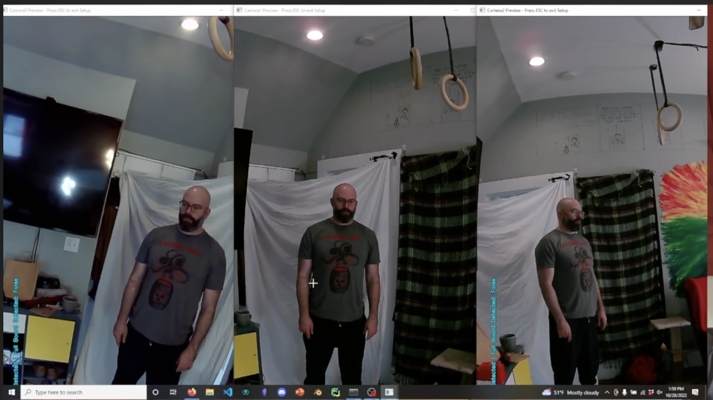
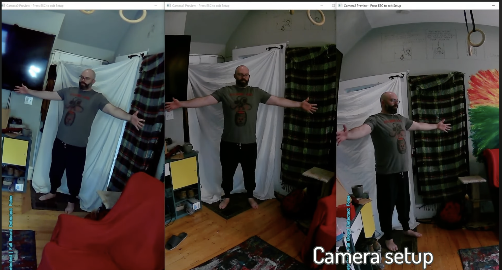

 #  Create a New FreeMoCap Recording Session

In order to follow this tutorial, you'll need to have already successfully [installed the software.](Freemocap_Software_Installation.md)

*This tutorial will use the pre-alpha version of freemocap and (version 0.0.54) to record the synchronized videos and then load them into the alpha version of freemocap to process them. That's just the status of things for now folks. We'll update things as they change. 

## Setting Up your Equipment

You'll want to set up your cameras in a semi circle such that their fields of view are partially overlapping. That overlapping field of view is going to define what's called the **"Capture Volume"**, which is the 3D space in the room that you can get a good recording of someone doing something. So, what ever action you're recording, each camera needs to have that person in its view. 

**How far away should the cameras be from the person you're recording?** 
- This really depends on the space you're recording in and the activity you plan to record. You'll want each camera generally as close as possible (to get as much data as you can) **BUT** you also need each camera to be set up far enough away such that they can capture the entire body of the person they're recording. Keep in mind the action the person is doing, if they're reaching their arms out, or jumping, or moving side to side, your cameras need to be able to see all of the person the entire time throughout the recording. 

This software doesn't handle incomplete bodies very well at the moment. 

**Some other helpful camera placement considerations:** 
- If possible, it's helpful for the background of the recording to be as visually simple as possible (a white wall, or a white sheet covering up your aweseom art on the wall). This will remove visual complexities and improve the trackability of the movement. 
- If there are any mirrors around, cover those up or remove them. 
- It's helpful (but not necessary) to be in a room where you have some control over lighting (dimmers, blinds, curtains, etc). 
- Avoid having shadows in your recording space. 

You'll do some final tweaking of the camera orientation as you go through the calibration process below. 

---

## Calibration

Calibration is most helpful to do with a second person.

### **Camera placement and settings adjustment**

#### **Alpha Version:**
This process is a little jenky right now, we're working to clean this up, but here it is. 

1.  Open up the terminal and activate the freemocap-gui environment. You created this environment when you installed the software, according to [this tutorial](Freemocap_Software_Installation.md).
```
(base) $ conda activate freemocap-gui
(freemocap-gui)
```
2. Now you'll need to point your terminal towards whichever location you git cloned the repository to when you followed the [software installation tutorial](Freemocap_Software_Installation.md). If you forgot, locate the freemocap folder on your machine (it's a folder called freemocap) and then copy the folder path. Then you can paste it into the terminal using the command 'cd' before it. 
```
(freemocap-gui) $ cd freemocap
```
3. Now you'll run the .py file that will start the alpha GUI. 
```
(freemocap-gui) python src/gui/main/main.py
```
And there you have it, the alpha GUI should pop up in its own window on your machine. 

4. **Create New Session:**

- On the GUI, click the "Create New Session" Button. This will give you the option to name your session. You're welcome to name it whatever you like, although an auto-generated one will be made for you, with the format year, month, day, hour, second of creation. 
- Click 'Start Session'
- You should now see viewing panes for each camera, including your built in laptop comaera, if you have one. If you have a built in laptop camera, on the left hand side of the GUI, **unselect your laptop camera**. 
- Here's your chance to mess with the camera settings. The most prominant ones are lighting and resolution. 
We'll create a how-to guide for camera settings soon. 
- Here's where the second person comes in handy, have them stand in the spot where they want to be doing the to-be-recorded movement. While they stand there, you can adjust the cameras such that:
   1.   All cameras have that person in their view, with overlapping fields of view. 
   2.  All cameras views will encompass the entire activity of the person. 
   3. Ideally, cameras are oriented in portrait mode, but that's not totally necessary. 

#### **Pre-alpha version:**

1. **Activate the pre-alpha freemocap environment.** If you followed [this software installation tutorial](Freemocap_Software_Installation.md), then you would have already made this environment, and all you need to do now is to activate it. If you haven't made this environment yet, please refer back to those intallation instructions and create an environment with the pre-alpha version of freemocap (freemocap version 0.0.54, python version 3.7). 

```
(base) $ conda activate freemocap-env
(freemocap-env)
```
2. **Create an ipython instance inside your terminal.** The output of the command below will tell you what version of python is running, it should be version 3.7. 
```
(freemocap-env) $ ipython
```
3. **Import freemocap and run the RunMe.py file.** **This is where you set the charruco square size**, which is the length of one of the black charucco board sqaures, in millimeteres. Yes, you need to measure this because this number changes depending on how large your printed out charuco board is. 
```
In [1]: import freemocap
In [2]: freemocap.RunMe(charucoSquareSize=126)
```
4. **Open Camera Settings.** A small grey GUI box will appear with the number of cameras that the software detects (If you have three cameras and a built in laptop camera, you'd see 0, 1, 2, 3). Select all cameras, toggle into 'Setup' mode, and click 'Submit'. 

5. **Select camera settings.** You're likely not going to get all this right the first try. So just know that you can affect:
   - Camera view rotation
   - Resolution width and height
      - 1280 x 720 (w x h) is a great place to start and is the default for pre-alpha. 
   - Exposure
      - adjusting this will lighten or darken the video feed. Adjust this so that the video feed looks as normal as possible (Not too dark and not too light). What you set the exposure to will depend on the location of your recording and now much light there already is. 
   - Frames per second
      - don't bother changing this. 
   - CODEC
      - don't bother changing this. 

6. **Observe and adjust camera settings.** Once camera settings are selected, click the 'Submit' button. You should see all your cameras viewing panes popup. Each pane will be numbered as camera 0, camera 1, etc. If any of them are crashing, please refer to [this troubleshooting guide for calibration errors.](../How%20to%20Guides/Troubleshooting_Guides.md)


Notice how your camera views all look. You want to get your settings right before you procede with the calibration. You may do a few rounds of adjustments and that's fine. So, if something is off (see bullet points below):

   - press 'quit' and all the viewing panes will disappear to be replaced with a small grey GUI. 

   - select 'Change Parameters' to go back to the settings adjustment GUI. 

   - Adjust your settings according to what you observed. 
   
   - Select 'Submit' in the settings adjustment pane and you should see your video viewing panes pop back up. Verify your adjustments worked, repeat this adjustment process if necessary.  

   - [Here's what to do](../How%20to%20Guides/Troubleshooting_Guides.md##Builtin-laptop-camera-is-being-picked-up-by-freemocap)
 if you notice one of the video panes is coming from your laptops built in webcam.

7. **Adjust camera positions**

   - As you adjust the cameras positions, it's super helpful if you have somebody standing in the area the recording will take place (this is why friends are awesome). 

   - Once you can view each cameras viewing pane, **this is a great time to label your cameras so they're easier to refer to in the future.** Figure out which camera is camera 1, and mark the camera and the USB cable (colored tape, etc), do that for each camera. It'll help you stay organized, trust us. 
   
   - Take note of any cameras you may need to rotate the viewing pane so that you're **Recoring in a portraight orientation**. This will be best for recording humans to maximize the amount of pixel data for your recorded movement. 

   

**You need to make sure the entire movement you're recording will be in frame of each camera.** 

   This is bad: 
   This is good: Although it could be a little better if the fingers were completely visible. 

8. **Adjusting Lighting** 
   -  You want the lighting to look the same in all cameras. You will only be able to adjust exposure for all of them, not each individually. If one of the cameras exposure is markedly different, you may need to physically move the camera, cover a window, unscrew a light bulb, etc to affect the lighting in that area. You'll be able to adjust this setting before moving forward in the calibration process.

   - You want the video to look a little dark. A good test is to wave your hand infront of one of the cameras and see if your fingers are blurry or in focus. Since we're recording movement here, **we want movement to be in focus**, not blurry. 

   - If videos are too dark, quit out of all the video panes, select "change parameters", and adjsut the exposure setting. The default is -7. 

      -  **To increase exposure (make it brighter)**, increase the number (so, going from -7 to -6, for example).
      - **To decrease exposure (make is darker)**, decrease the number (so, going from -7 to -8, for example). 

Once you're happy with your camera set up and settings, you can transition to recording the calibration videos themselves, hooray :) 

---

## Recording Calibration Videos with Charuco Board


## Looking at Timestamp Diagnostics
## Recovering from a crash
 
## Recording movement
## 
